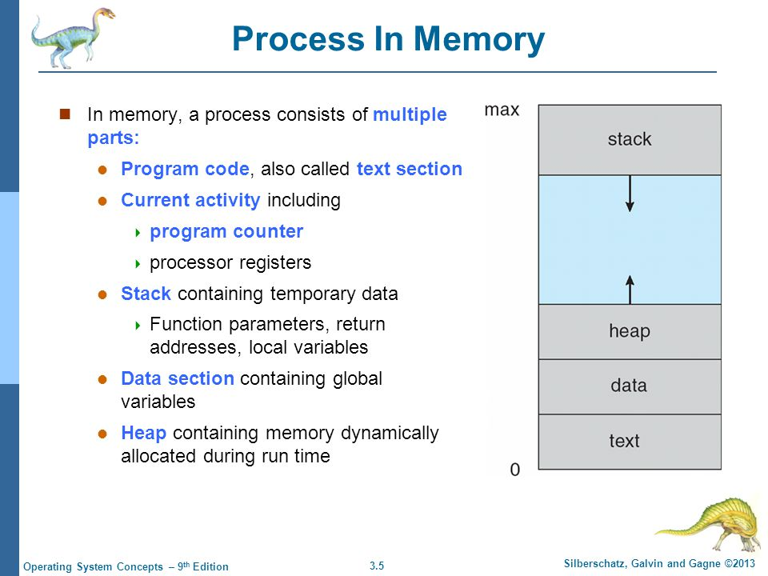
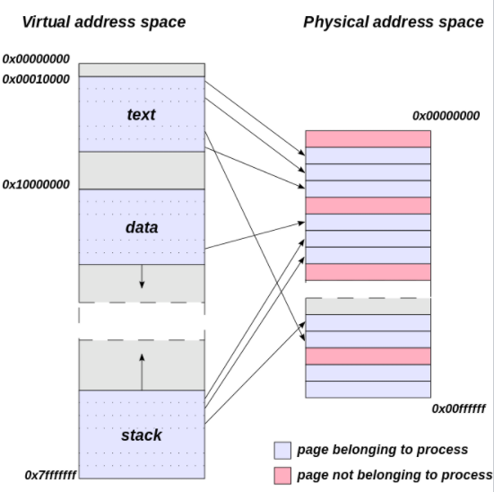
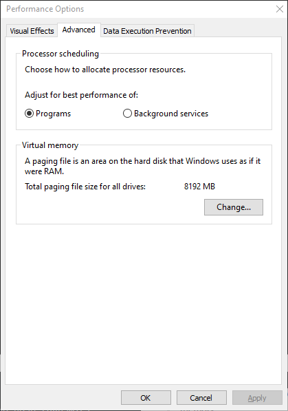
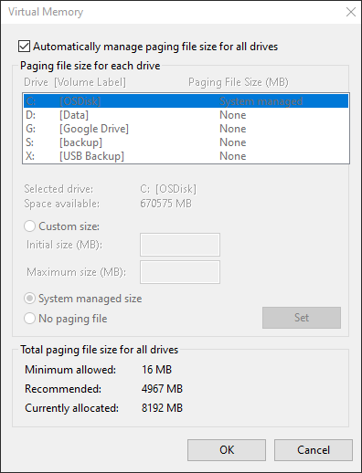
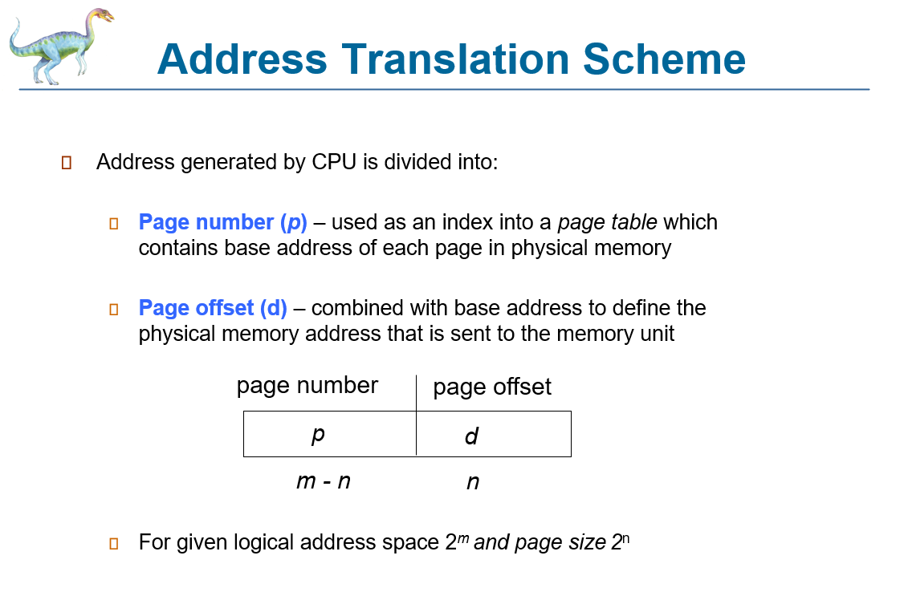
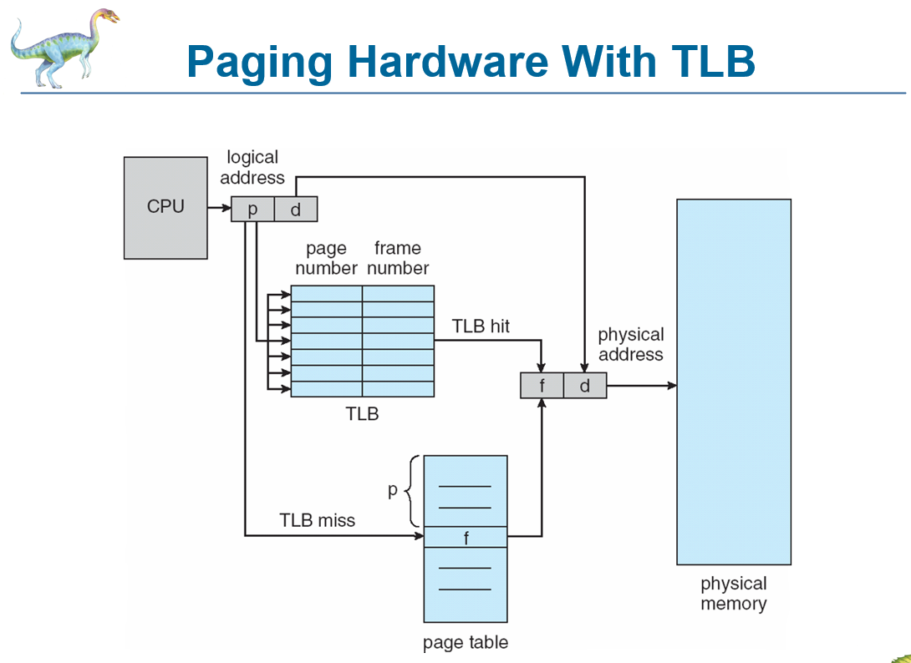
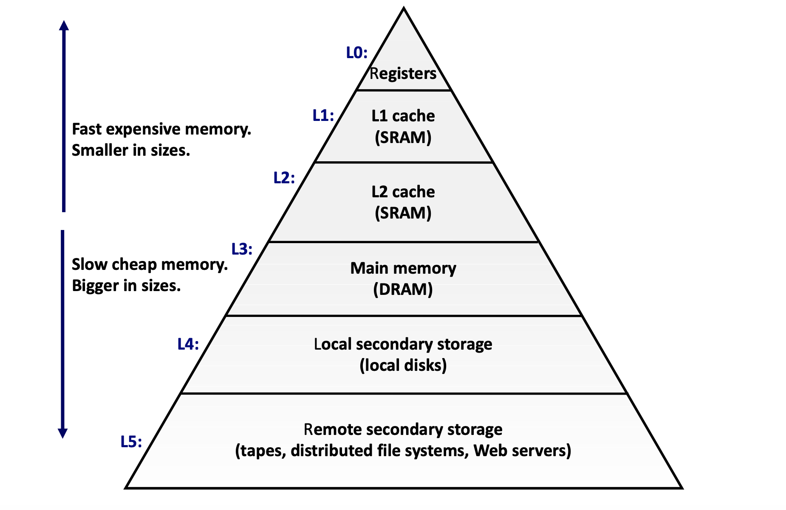

# 13-2 Prepare: Memory

This lesson is focusing on how memory is managed by operating systems.

## Process Control Block (PCB)

A process control block (PCB) is a data structure used by computer operating systems to store all the information about a process. It is also known as a process descriptor.

- When a process is created (initialized or installed), the operating system creates a corresponding process control block.
- Information in a process control block is updated during the transition of process states.
- When the process terminates, its PCB is returned to the pool from which new PCBs are drawn.
- Each process has a single PCB.

### Example PCB used in Linux

In this example of the PCB in Linux, you can see pointers to the parent process and well as pointers to any threads.

- [Linux PCB Structure](https://web.cs.wpi.edu/~claypool/courses/3013-A02/samples/linux-pcb.c)

## Process memory

When a program is loaded by the operating system, A PCB is created and memory is assigned to the process.  The memory assigned to a process is called virtual memory.  The process believes it is the only process running in the computer and has access to all memory locations.  Using this modal, a process doesn't need to worry about accessing memory where another process might be using it.  

Virtual memory is larger than the actual physical memory of the computer.  In the figure below, the address space goes from address 0 to a maximum address (2^31 for 32-bit computers and 2^63 for a 64-bit computer)

## Memory Page

> A page, memory page, or virtual page is a fixed-length contiguous block of virtual memory, described by a single entry in the page table. It is the smallest unit of data for memory management in a virtual memory operating system. Similarly, a page frame is the smallest fixed-length contiguous block of physical memory into which memory pages are mapped by the operating system.
> 
> A transfer of pages between main memory and an auxiliary store, such as a hard disk drive, is referred to as paging or swapping.

Memory blocks can be any power of 2.  However, they tend to be 4k in size.  If the block size is too small, then the OS needs to keep track of lots of memory blocks.  However, if the block is too large, you can have more memory wastage.  4K blocks are a good compromise.

## Page Table

> A page table is the data structure used by a virtual memory system in a computer operating system to store the mapping between virtual addresses and physical addresses. Virtual addresses are used by the program executed by the accessing process, while physical addresses are used by the hardware, or more specifically, by the RAM subsystem. The page table is a key component of virtual address translation which is necessary to access data in memory.

-- [What is a Page Table](https://en.wikipedia.org/wiki/Page_table)

When your process is using memory blocks, the operating system makes that process think that it has all of the memory of the system and even more.  When a process uses a memory location, that memory address needs to be translated to an actual memory block on the computer.  This translation from logical to physical memory is managed by the page table.  Each process has their own page table.  

A page table also allows the operating system to place infrequently used blocks to be placed in a swap file that is on the hard drive.

Here are the Windows 10 options for setting the ""swap file" or paging file.  It is best that you let the system decide on these values if you don't know what you are changing.

Click on the "Change.." button above.

[MAC OS Page Swap File](https://apple.stackexchange.com/questions/399878/how-do-i-increase-size-of-virtual-memory-in-mac-os-catalina)

## How Logical Addresses are Mapped to Physical addresses

-- [Wikipedia on TLB](https://en.wikipedia.org/wiki/Translation_lookaside_buffer)

> A translation lookaside buffer (TLB) is a memory cache that is used to reduce the time taken to access a user memory location. It is a part of the chip's memory-management unit (MMU). The TLB stores the recent translations of virtual memory to physical memory and can be called an address-translation cache. A TLB may reside between the CPU and the CPU cache, between CPU cache and the main memory or between the different levels of the multi-level cache. The majority of desktop, laptop, and server processors include one or more TLBs in the memory-management hardware, and it is nearly always present in any processor that utilizes paged or segmented virtual memory.

### Virtual Addresses

A virtual address is made up of two main sections (On a 64-bit computer, there are 3 more sections)

**Page Offset**

The size of the page offset matches and memory page size.  For a 4K page size system, the page offset is 12 bits.

**Page Number**

The first page of the virtual address is used to index into the TLB.  It is a page number.  On a 32-bit system with page size of 4k, this section is 20 bits.

Logical Address are divided in the page number and page offset parts.  The page number is then used by the TLB to see if there is a mapping between virtual page number to physical page number (frame number).  If found, the frame number is combined with the page offset.  This new address is used to access physical memory.

A TLB miss means that the TLB wasn't able to find a match between the virtual page number and a frame.  Here the computer needs to look into the PCB of the process to find a match.

## Cache

> In computing, a cache is a hardware or software component that stores data so that future requests for that data can be served faster; the data stored in a cache might be the result of an earlier computation or a copy of data stored elsewhere. A cache hit occurs when the requested data can be found in a cache, while a cache miss occurs when it cannot. Cache hits are served by reading data from the cache, which is faster than recomputing a result or reading from a slower data store; thus, the more requests that can be served from the cache, the faster the system performs.
> 
> To be cost-effective and to enable efficient use of data, caches must be relatively small. Nevertheless, caches have proven themselves in many areas of computing, because typical computer applications access data with a high degree of locality of reference. Such access patterns exhibit temporal locality, where data is requested that has been recently requested already, and spatial locality, where data is requested that is stored physically close to data that has already been requested.

### Issues with Context Switching

Each time a process needs to be places on the waiting or blocking queue, the OS must preform a context switch.  When a process has been running on the CPU for a little while, the cache is filling up with data that is being used by that process.  This increases the speed of the process.  When another process is placed on the CPU, the cache doesn't have any data for that process.  As values are retrieved from main memory and places in the cache, old values in the cache are replaced.  When that process is placed on the waiting queue and the first process returns to the CPU, it's data is not in the cache, so it needs to retrieve data from main memory and so on.  If you can reduce the amount of context switching, you can speed up your program.

The term the `cache is hot` means that the values in the cache are being used by the process running on the CPU and main memory doesn't need to be accessed.  The `cache is cold` means that the currently running process has no data in the cache and main memory must be accessed.

